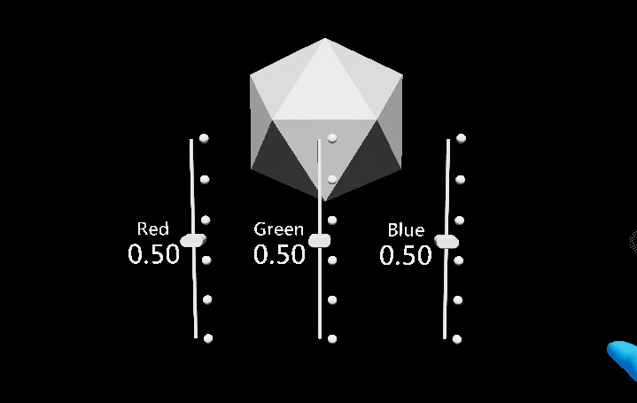
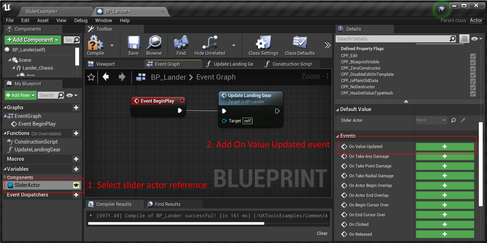

# Pinch slider

Sliders are UI components that allow you to continuously change a value by moving a slider on a track. Currently the Pinch Slider can be moved by directly grabbing the slider, either directly or at a distance.

## Example scene

You can find examples in the **SliderExample** map in the _UX Tools Examples_ plugin.

## How to use sliders

You can simply add a [`UxtPinchSliderActor`](xref:_a_uxt_pinch_slider_actor) to your level. This will give you a HoloLens 2 style slider ready to use. To react to changes to the slider value subscribe to the `OnValueUpdated` event in the actor:

If the default slider actor doesn't suit your needs, you can create your own slider from scratch following these steps:

1. Create a new actor blueprint with a [`UxtPinchSliderComponent`](xref:_u_uxt_pinch_slider_component) as the root component of the actor.

2. Add a Sphere static mesh to the actor and call it _Thumb_. Set its scale to _0.025_.

3. Select the UxtPinchSliderComponent and set the _Visuals_ property to reference the sphere mesh.

4. Add a Cylinder static mesh to the actor and call it _Track_. Set its scale to _(0.01, 0.01, 0.5)_ and its X rotation to _90_ degrees.

5. If the slider is configured correctly it will look like this:

## Events

`UxtPinchSliderActor` has just one event, covering the most common use case:

- **OnValueUpdated**: raised when the slider value changes.

`UxtPinchSliderComponent` has a number of events that can be used to respond to slider input:

- **OnUpdateState**: raised when the slider changes state.
- **OnBeginFocus**: raised when a pointer starts focusing the slider.
- **OnUpdateFocus**: raised when a focusing pointer updates.
- **OnEndFocus**: raised when a pointer stops focusing the slider.
- **OnBeginGrab**: raised when the slider is grabbed.
- **OnUpdateValue**: raised when the slider's value changes.
- **OnEndGrab**: raised when the slider is released.
- **OnEnable**: raised when the slider is enabled.
- **OnDisable**: raised when the slider is disabled.